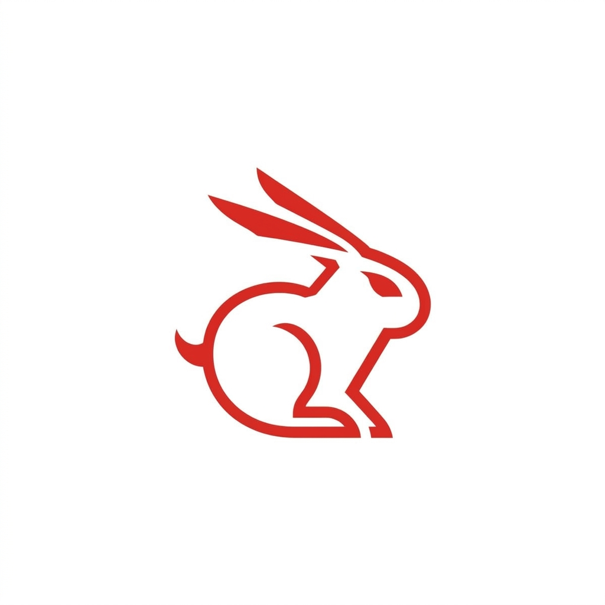

<p align="center">
  
</p>

<h1 align="center">toki-sync</h1>

<p align="center">
  <b>여러 디바이스의 토큰 사용량을 동기화하는 셀프호스트 서버. <a href="https://github.com/korjwl1/toki">toki</a> 생태계용</b><br>
  모든 기기의 AI 도구 사용량을 수집하고, 로컬에 이벤트를 저장하며, 통합 대시보드를 제공합니다.
</p>

<p align="center">
  <a href="https://hub.docker.com/r/korjwl11/toki-sync"></a>
  <a href="https://hub.docker.com/r/korjwl11/toki-sync"></a>
  <a href="https://hub.docker.com/r/korjwl11/toki-sync"></a>
  <a href="LICENSE"></a>
</p>

<p align="center">
  <a href="README.md">English</a>
</p>

---

## 빠른 시작

`git clone` 불필요. `docker-compose.yml`과 `.env`만 만들면 됩니다.

**1. `docker-compose.yml` 생성**

```yaml
services:
  toki-sync-server:
    image: korjwl11/toki-sync:latest
    container_name: toki-sync-server
    restart: unless-stopped
    ports:
      - "9090:9090"   # 동기화 프로토콜 (TCP)
      - "9091:9091"   # 웹 대시보드 + API (HTTP)
    environment:
      TOKI_ADMIN_PASSWORD: ${TOKI_ADMIN_PASSWORD}
      JWT_SECRET: ${JWT_SECRET}
    volumes:
      - toki-data:/data

volumes:
  toki-data:
```

**2. `.env` 생성**

```bash
TOKI_ADMIN_PASSWORD=강력한-비밀번호로-변경하세요
JWT_SECRET=openssl-rand-base64-32-실행-결과로-변경하세요
```

**3. 시작 및 연결**

```bash
docker compose up -d

# toki가 설치된 아무 기기에서 (브라우저를 열어 인증)
toki settings sync enable --server <서버-IP-또는-도메인>
```

완료. 이제 모든 기기의 토큰 사용량이 자동으로 동기화됩니다.

> **자동 TLS가 필요하신가요?** [Caddy + DuckDNS 배포 가이드](docs/deploy-caddy-duckdns.ko.md)에서 무료 도메인과 자동 갱신 인증서로 HTTPS를 설정하는 방법을 확인하세요.

---

## Docker 이미지

| 항목 | 값 |
|---|---|
| 이미지 | [`korjwl11/toki-sync`](https://hub.docker.com/r/korjwl11/toki-sync) |
| 태그 | `latest`, `2.0.0` |
| 플랫폼 | `linux/amd64`, `linux/arm64` |

### 단독 실행 (기본)

**Fjall** (내장 이벤트 스토어) + **SQLite** (메타데이터) 사용. 외부 의존성 없이 단일 컨테이너만으로 동작합니다.

### ClickHouse 연동 (선택)

대용량 환경에서는 `--profile clickhouse` 플래그를 추가하세요:

```bash
docker compose --profile clickhouse up -d
```

toki-sync와 함께 ClickHouse 컨테이너를 시작하여 확장 가능한 이벤트 저장소를 제공합니다. 자세한 내용은 [`docker-compose.yml`](docker-compose.yml)을 참고하세요.

---

## 누구를 위한 건가요?

- **여러 기기 사용?** 모든 AI 토큰 사용량을 한 곳에서 확인 -- 웹 대시보드 또는 [Toki Monitor](https://github.com/korjwl1/toki-monitor).
- **팀 대시보드?** 역할 기반 접근 제어로 팀원 간 사용량을 집계합니다.
- **셀프 호스팅?** 데이터가 내 서버에만 남습니다. 텔레메트리 없음, 클라우드 없음.

---

## 작동 방식

```text
[디바이스 A]  [디바이스 B]  [디바이스 C]
toki daemon   toki daemon   toki daemon
     +-- TCP+TLS (bincode) --+
                              v
                      toki-sync 서버
                      |-- TCP :9090 (동기화 프로토콜)
                      |-- HTTP :9091 (인증 + 대시보드)
                      +-- SQLite (메타데이터)
                      +-- Fjall (이벤트) 또는 ClickHouse (선택)
```

- **toki 데몬**이 지속 TLS 연결을 유지하고, 이벤트를 배치(1,000/배치)로 zstd 압축 후 ACK 기반 흐름 제어로 전송합니다
- **toki-sync 서버**가 사용자를 인증하고, SQLite에 메타데이터를 저장하며, 이벤트 스토어에 기록합니다
- **중복 제거**는 `msg_id`로 처리하여 재연결 시에도 정확히 한 번 전달을 보장합니다

---

## 기능

- **멀티 디바이스 동기화** -- TCP 바이너리 프로토콜, zstd 압축, ACK 흐름 제어, 재연결 시 증분 동기화 (delta sync)
- **디바이스 코드 인증** -- 브라우저 기반 device code flow, OIDC (Google, GitHub 등), 비밀번호 로그인
- **웹 대시보드** -- 차트, 시간 범위 선택, 디바이스 목록, 팀 뷰
- **팀** -- 역할 기반 접근 제어로 팀 멤버 간 집계 쿼리
- **듀얼 스토리지** -- SQLite (설정 불필요) 또는 PostgreSQL; Fjall (내장) 또는 ClickHouse (대규모)
- **PromQL 프록시** (선택) -- VictoriaMetrics 호환을 위한 사용자별 라벨 주입
- **보안** -- 모든 구간 TLS 적용, 무차별 대입 방지, 리프레시 토큰 로테이션

---

## 개인정보 보호 및 보안

- **프롬프트 접근 없음** -- 토큰 수와 메타데이터(모델, 세션 ID, 프로젝트명)만 전송. 프롬프트나 응답은 절대 전송하지 않습니다.
- **모든 곳에 TLS** -- 모든 동기화 트래픽이 암호화됩니다. Caddy가 Let's Encrypt 인증서를 자동 관리합니다.
- **사용자별 데이터 격리** -- 각 사용자는 자신의 데이터만 조회할 수 있습니다.
- **셀프 호스팅** -- 텔레메트리 없음, 클라우드 의존성 없음.

---

## 문서

[배포 가이드](docs/deployment.ko.md)에서 시나리오를 선택한 뒤, 필요할 때 아래 문서를 참고하세요.

| 문서 | 언제 읽나 |
|---|---|
| [배포 가이드](docs/deployment.ko.md) | 인프라에 맞는 시나리오 (A/B/C/D) 선택 |
| [아키텍처와 설계](docs/DESIGN.ko.md) | Sync 프로토콜, 커서 관리, 보안 모델, 스케일링 |
| [설정 레퍼런스](docs/CONFIGURATION.ko.md) | 전체 TOML 옵션, 기본값, 환경 변수 |
| [HTTP API 레퍼런스](docs/API.ko.md) | 전체 엔드포인트, 요청/응답 예시, 인증 |
| [커스텀 대시보드](docs/custom-dashboard.ko.md) | toki-sync 쿼리 API 위에 자체 UI 구축 |
| [백업과 복원](docs/backup.ko.md) | 볼륨 구조, 핫/콜드 백업, 복원 |
| [문제 해결](docs/troubleshooting.ko.md) | 연결, TLS, 대시보드, 동기화 문제 진단 |
| [기여 가이드](CONTRIBUTING.ko.md) | 개발 환경, 브랜치 이름, 커밋 규칙, DCO |

---

## 연결 해제

```bash
toki settings sync disable              # 원격 데이터 삭제 여부를 묻습니다
toki settings sync disable --delete     # 서버에서 이 디바이스의 데이터를 삭제합니다
toki settings sync disable --keep       # 원격 데이터를 유지하고 로컬에서만 비활성화합니다
```

---

## Sponsor

<a href="https://github.com/sponsors/korjwl1">
  
</a>

toki-sync가 유용하다면 스폰서로 개발을 지원해 주세요.

유료 제품에서의 상업적 사용은 스폰서 등록 또는 [연락](mailto:korjwl1@gmail.com)을 부탁드립니다.

---

## 라이선스

[FSL-1.1-Apache-2.0](LICENSE)
